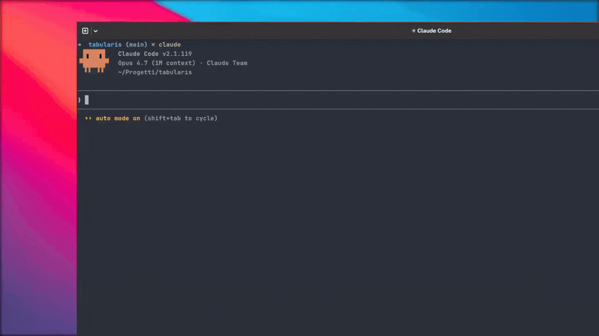

<div align="center">

# GapHunter

### Turn your competitors' 1-star reviews into your roadmap.

A [Claude Code](https://claude.com/claude-code) skill — **fully designed, written, and refined with Claude Code itself** — that mines G2, Capterra, TrustRadius, Reddit, GitHub Issues and Hacker News for the features users hate the most about your competitors, and ships a self-loading HTML report that maps each gap to a concrete plan in **your** codebase.

[](https://claude.com/claude-code)
[](https://docs.claude.com/en/docs/claude-code/skills)
[](./templates/gaphunter-report-template.html)
[](#)

[](https://github.com/debba/gaphunter-skill/stargazers)
[](https://github.com/debba/gaphunter-skill/network/members)
[](https://github.com/debba/gaphunter-skill/issues)
[](https://github.com/debba/gaphunter-skill/pulls)
[](https://github.com/debba/gaphunter-skill/commits/main)
[](https://github.com/debba/gaphunter-skill/pulls)

[**Quick start**](#-quick-start) ·
[**How it works**](#-how-it-works) ·
[**Report anatomy**](#-report-anatomy) ·
[**Reference**](#-reference)

---

<div align="center">

  <a href="https://github.com/debba/gaphunter-skill/raw/main/.github/media/demo.mp4">
    
  </a>

</div>

---

## ✨ Why GapHunter

You already know your competitors aren't perfect. **GapHunter tells you exactly where they're bleeding users**, then crosses it against your own repo so you don't waste a sprint reinventing what you already shipped.

- 🎯 **Stop guessing what to build next.** Your roadmap is hiding inside the 1-star reviews of the products people are leaving.
- 🧠 **Goes deeper than scraping.** Findings are clustered semantically (`"no dark mode"` + `"lacks dark theme"` → one finding) and tagged with frequency, trend, status, effort, and priority.
- 🛠️ **Actually wired to your code.** Every gap surfaces with the files in your project to touch and concrete implementation steps, not vague suggestions.
- 📊 **Ships a polished report.** A self-contained dark-mode HTML viewer with tabs, filters, a Priority/Effort quadrant, side-by-side competitor comparison, and PDF export.

---

## 🚀 Quick start

```bash
git clone https://github.com/debba/gaphunter-skill.git
cd gaphunter-skill
bash install.sh
```

Restart Claude Code, then in any project run:

```text
/gaphunter DBeaver
/gaphunter DBeaver TablePlus           # multi-competitor comparison
/gaphunter Notion --sources-only       # dump raw findings to chat, no files
```

GapHunter writes two paired files into `docs/` of the current project:

```
docs/
├── dbeaver-gap-report.html   ← double-click this
└── dbeaver-gap-data.json     ← sidecar (re-render / diff)
```

**View the report:** the data is inlined into the HTML, so just double-click `dbeaver-gap-report.html` — it renders directly on `file://`, no server needed. The sidecar JSON is kept for re-rendering and external use.

---

## ⚡ How it works

Five phases, all run in a single `/gaphunter` invocation:

| Phase              | What happens                                                                                                                                                                                                                   |
| ------------------ | ------------------------------------------------------------------------------------------------------------------------------------------------------------------------------------------------------------------------------ |
| **1 · Research**   | Parallel `WebSearch` + `WebFetch` across G2, Capterra, TrustRadius, Reddit, GitHub Issues, Hacker News (`hn.algolia.com` API never 403s). Near-duplicates are clustered semantically.                                          |
| **2 · Explore**    | Reads `package.json` / `Cargo.toml` / `pyproject.toml`, lists `src/`, greps for complaint keywords — to learn what your project already does.                                                                                  |
| **3 · Synthesise** | Cross-references complaints against your codebase. Assigns each finding `priority`, `status`, `effort`, `trend`, `frequency`. Computes a **Competitive Score** and counts **Quick Wins**.                                      |
| **4 · Generate**   | Writes `docs/<product>-gap-data.json` and copies the viewer template to `docs/<product>-gap-report.html` with the JSON inlined into a `<script type="application/json">` block, so the HTML opens self-contained on `file://`. |
| **5 · Report**     | States the file paths, the top 3 priorities, and any sources that 403'd.                                                                                                                                                       |

---

## 🗺️ Report anatomy

Seven tabs, each owned by a single template:

| #   | Tab            | What it surfaces                                                                         |
| --- | -------------- | ---------------------------------------------------------------------------------------- |
| 01  | **Summary**    | Top critical / warning / positive insights                                               |
| 02  | **Quick Wins** | `priority: high` × `effort: small` — start here                                          |
| 03  | **Analysis**   | All findings grouped by theme, with verbatim user quotes                                 |
| 04  | **Comparison** | Competitor × feature matrix with **★ All** universal-gap markers (multi-competitor only) |
| 05  | **Gap Matrix** | Full table, with per-source pill toggles to slice the view                               |
| 06  | **Plan**       | Implementation cards with steps and **files to touch** in your repo                      |
| 07  | **Sources**    | Every URL consulted, marked `ok` / `snippet` / `blocked`                                 |

Plus: sticky filter panel (search, priority, status, effort, source, theme, trend), Priority/Effort SVG quadrant in the hero, Permalink button, JSON export, PDF export, light-mode print stylesheet.

---

## 🎨 Design

Dark-mode "intelligence console" aesthetic — not your average dashboard. Restrained glass panels on a `#080b12` ink background, cyan/violet accents, frequency and trend badges, sharp typography, 8px corner radius across the board.

The viewer template is **the** source of truth for HTML / CSS / JavaScript. The skill writes data, not styles.

---

## 📚 Reference

<details>
<summary><strong>JSON schema</strong></summary>

```js
{
  meta: {
    productName: "",          // e.g. "DBeaver" or "DBeaver, TablePlus"
    projectName: "",
    generatedAt: "",          // ISO date
    sourceCount: 0,
    findingCount: 0,
    highPriorityCount: 0,
    dataQualityNote: "",      // shown as banner if non-empty
    competitiveScore: 0,      // 0–100; higher = more opportunity
    quickWinCount: 0
  },
  summary: [
    { id: "", severity: "critical|warning|positive", title: "", text: "" }
  ],
  findings: [
    {
      id: "",
      theme: "",
      title: "",
      description: "",
      priority: "high|medium|low",
      status: "missing|partial|present",
      effort: "small|medium|large|none",
      frequency: "many|some|single",
      trend: "persistent|recent|unknown",
      sources: ["G2"],
      quotes: [{ text: "", cite: "" }],
      implementationSteps: [""],
      filesToTouch: [""]
    }
  ],
  sources: [
    { name: "", type: "", url: "", access: "ok|blocked|snippet", note: "" }
  ]
}
```

`trend` defaults to `"unknown"`, `competitiveScore` and `quickWinCount` are recomputed on the fly if absent.

</details>

<details>
<summary><strong>Multi-competitor source attribution</strong></summary>

In multi-competitor mode every source name is prefixed with the competitor:

```
"DBeaver/G2"     "DBeaver/Reddit"
"TablePlus/G2"   "TablePlus/GitHub"
```

The Comparison tab parses this prefix to detect competitors automatically; the toggle pills above the table let you exclude any competitor from columns and row filter. **★ All** marks gaps cited for every active competitor — your highest-leverage targets.

</details>

<details>
<summary><strong>Project structure</strong></summary>

```
gaphunter-skill/
├── SKILL.md                                      # Skill definition (5-phase prompt)
├── CLAUDE.md                                     # Repo guide for Claude Code
├── templates/
│   └── gaphunter-report-template.html            # Shared viewer (v3.2.0)
└── install.sh / uninstall.sh                     # Symlink in/out of ~/.claude/skills/
```

</details>

<details>
<summary><strong>How the HTML loads the JSON</strong></summary>

The viewer reads its data from an inline `<script type="application/json" id="report-data">` block populated at generation time, so the file is fully self-contained and renders on a `file://` double-click.

If that block is empty or unreplaced, three fallbacks kick in, in order:

- `?data=<path>` query string — explicit override, useful for hosted dashboards.
- Sibling auto-fetch — derives `*-gap-data.json` from the HTML's own filename and `fetch`-es it (HTTP only; `file://` is blocked by browser CORS).
- Drag-drop loader screen — drop the JSON onto the placeholder card.

</details>

---

## 🤝 Contributing

PRs are welcome — especially:

- New review sources (Producthunt, AlternativeTo, Setapp, in-app store reviews)
- Localised review parsing (non-English G2/Capterra pages)
- Better semantic clustering heuristics
- Template improvements (charts, dependency graphs, theming)

Open an issue first if it's a non-trivial change. The visual contract for the report lives in [`templates/gaphunter-report-template.html`](./templates/gaphunter-report-template.html) — never copy-paste layout into individual reports.

---

## 🤖 Built end-to-end with Claude Code

GapHunter isn't just a Claude Code _skill_ — the entire project (skill prompt, viewer template, CSS, JavaScript, docs) was authored, iterated, and refactored inside Claude Code. The repository itself is a working example of what an AI-paired engineering workflow can ship: from blank repo to v3.2.0 viewer with tabs, a competitor matrix, per-source toggles, and self-contained `file://` reports, without leaving the terminal.

Want to build your own skill? Start at the [Claude Code skills docs](https://docs.claude.com/en/docs/claude-code/skills) and use this repo as a reference implementation.

---

## 📄 License

MIT — go build something better than your competitors.

---

<div align="center">

If GapHunter saved you a sprint, drop a ⭐ — it helps other founders find it.

[**🌟 Star this repo**](https://github.com/debba/gaphunter-skill) · [**🐦 Share on X**](https://twitter.com/intent/tweet?text=GapHunter%20—%20turn%20your%20competitors%27%201-star%20reviews%20into%20your%20roadmap.%20A%20Claude%20Code%20skill%20that%20mines%20G2%2C%20Capterra%2C%20Reddit%2C%20HN%20for%20feature%20gaps.&url=https%3A%2F%2Fgithub.com%2Fdebba%2Fgaphunter-skill) · [**📮 Open an issue**](https://github.com/debba/gaphunter-skill/issues)

Made with ☕ and [Claude Code](https://claude.com/claude-code) by [@debba](https://github.com/debba) — every line, including this one.

</div>
